# 04 — UML Diagrams
## Smart Market Watchlist — Top-20 Submission Design

**Version:** 1.0  
**Status:** Derived from `03_System_Architecture_v2_Top20.md`  
**Purpose:** Define the structural and behavioral UML views that will guide implementation.

---

# 1. UML Strategy

The UML set is intentionally focused rather than exhaustive.

The diagrams answer the most important architectural questions:

| Diagram | Question answered |
|---|---|
| Use Case | What does the user/system need to accomplish? |
| Component | What are the major software responsibilities and boundaries? |
| Class / Domain | What core entities and relationships exist? |
| Sequence — Watchlist Snapshot | How does a user request become an intelligent snapshot? |
| Sequence — Market Ingestion | How is external market data made trustworthy? |
| Sequence — Seen State | How do we safely persist "last seen" across devices? |
| Activity — Significance Engine | How do raw changes become attention + confidence? |
| State — Seen State | What lifecycle does a user's seen baseline follow? |
| Deployment | Where do the components run? |

The diagrams should remain consistent with the architecture. In particular,
the following distinctions must remain visible:

``` text
Raw data
   ↓
Normalized data
   ↓
Trusted market state
   ↓
Context
   ↓
Change
   ↓
Significance
   ↓
Attention + Confidence
   ↓
Explanation
```

This separation is deliberate: UML is most useful when each view communicates
one architectural concern rather than attempting to show the entire system
in one giant diagram. citeturn0search1turn0search9

---

# 2. Use Case Diagram

## 2.1 Scope

The primary actor is the **User**.

The system also interacts with external market-data providers. These are
modeled as external systems rather than users.

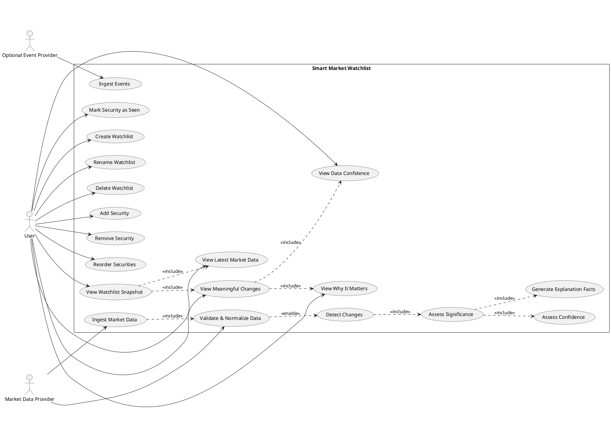

## 2.2 Key product interpretation

The most important use case is not simply:

``` text
View latest price
```

It is:

``` text
View meaningful changes since my last check
```

That use case depends on durable user state and contextual market analysis.

---

# 3. Component Diagram

## 3.1 High-Level Component View

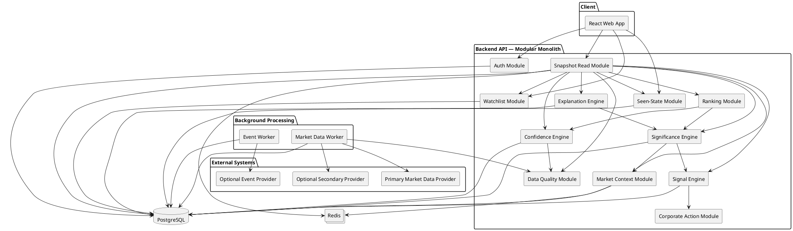

## 3.2 Architectural responsibility table

| Component | Responsibility | Must not own |
|---|---|---|
| Watchlist | Membership and ordering | Market calculations |
| Snapshot Read | Assemble a coherent response | Provider ingestion |
| Seen-State | User baseline lifecycle | Significance rules |
| Market Context | Benchmark/sector context | User personalization |
| Signal Engine | Detect measurable changes | UI wording |
| Significance Engine | Decide attention | Raw provider parsing |
| Confidence Engine | Evaluate evidence quality | Attention policy |
| Explanation Engine | Convert validated facts to explanation | Inventing causes |
| Data Quality | Freshness/conflict/integrity state | User ranking |
| Corporate Action | Comparison adjustment | General scoring |
| Worker | Ingest/process market observations | User-specific baselines |

This boundary discipline is important because component diagrams are most
useful when they expose responsibility and dependency direction rather than
implementation trivia. citeturn0search1

---

# 4. Domain Class Diagram

The domain model is intentionally centered on the product's differentiator:
**user baseline + trusted observation + contextual significance**.

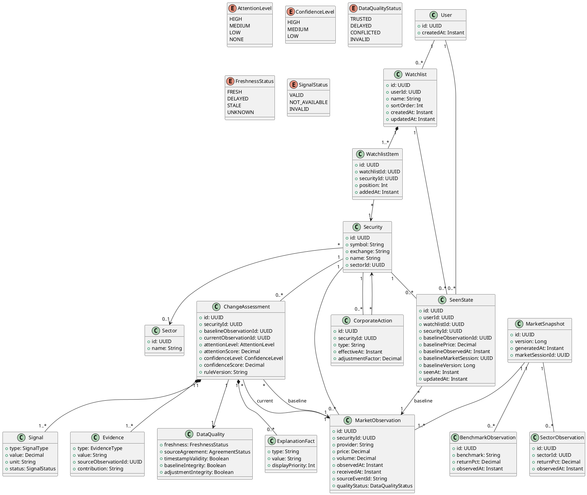

---

# 5. Important Domain Constraints

These are more important than simply drawing classes.

## 5.1 Observation identity

`MarketObservation.id` must uniquely identify the normalized observation.

``` text
Same source event
    ↓
same logical observation
```

Retries must not create duplicate effective observations.

## 5.2 Observation ordering

``` text
observedAt
    >
receivedAt
```

in terms of semantic importance.

A late network arrival must not make an older observation become the latest
effective market state.

## 5.3 Seen-state integrity

`SeenState.baselineObservationId` must point to an observation that was
actually eligible to be shown to the user.

## 5.4 Assessment reproducibility

A `ChangeAssessment` must retain enough provenance to reproduce its decision:

``` text
baseline observation
current observation
benchmark observation
sector observation
historical window
corporate-action reference
rule version
```

---

# 6. Sequence Diagram — User Opens Watchlist

This is the most important end-to-end product flow.

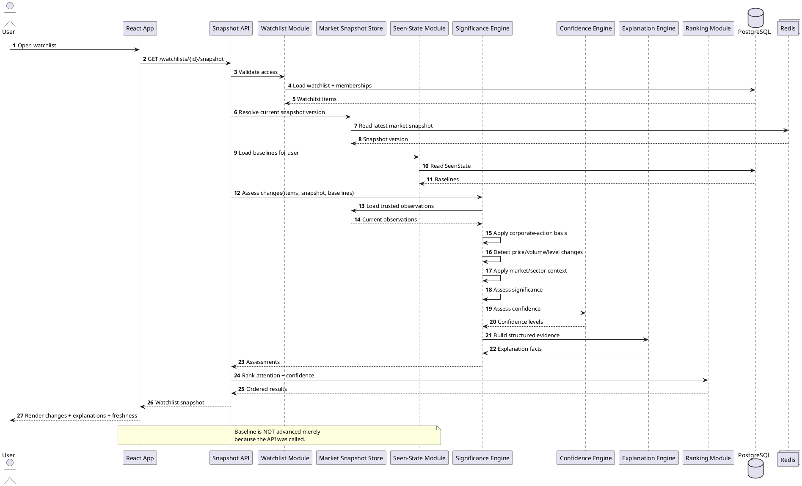

### Why this sequence matters

It demonstrates that the watchlist is not a simple CRUD screen.

The read path combines:

``` text
watchlist membership
+
consistent market snapshot
+
user baseline
+
context
+
significance
+
confidence
+
explanation
```

---

# 7. Sequence Diagram — Market Data Ingestion

The ingestion pipeline protects the product from bad external data.

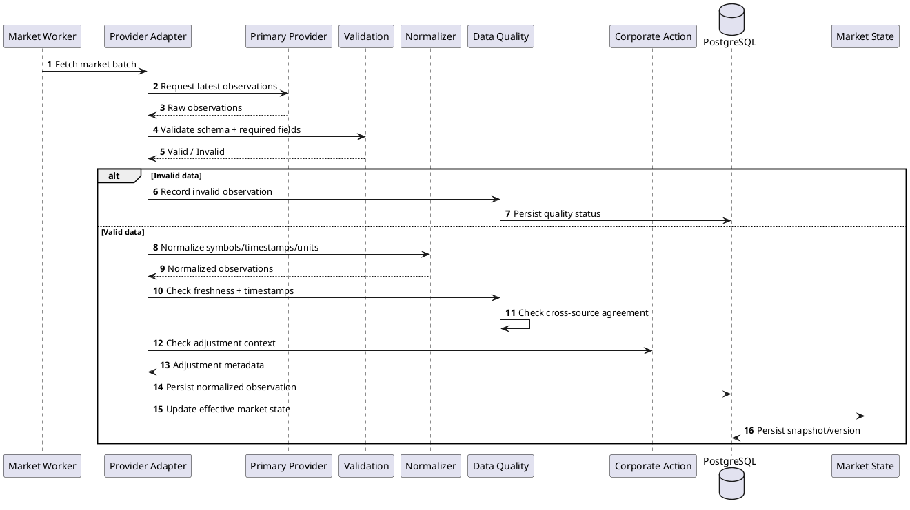

## 7.1 Failure behavior

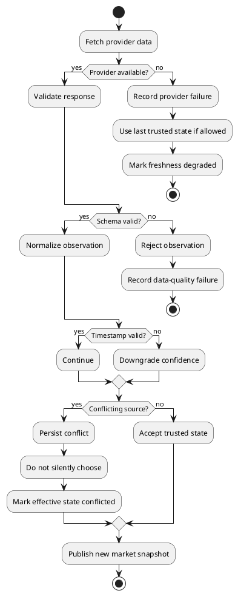

---

# 8. Sequence Diagram — Mark Security as Seen

This sequence is important because "last seen" is the product's memory.

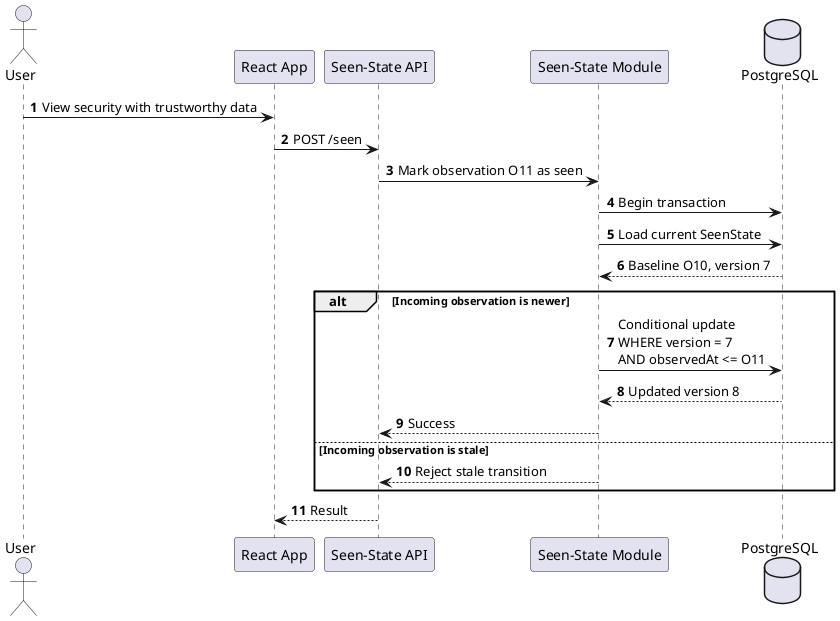

## 8.1 Concurrency invariant

For a security:

``` text
baselineObservedAt must never move backwards.
```

Therefore:

``` text
O10 @ 10:00
O11 @ 10:01

valid:
O10 → O11

invalid:
O11 → O10
```

---

# 9. Activity Diagram — Meaningful Change Engine

This diagram expresses the actual product intelligence.

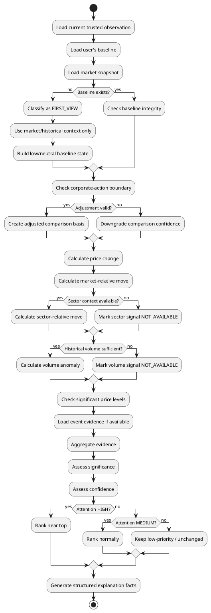

---

# 10. State Machine — Seen State

The state machine is useful because the meaning of "seen" is subtle.

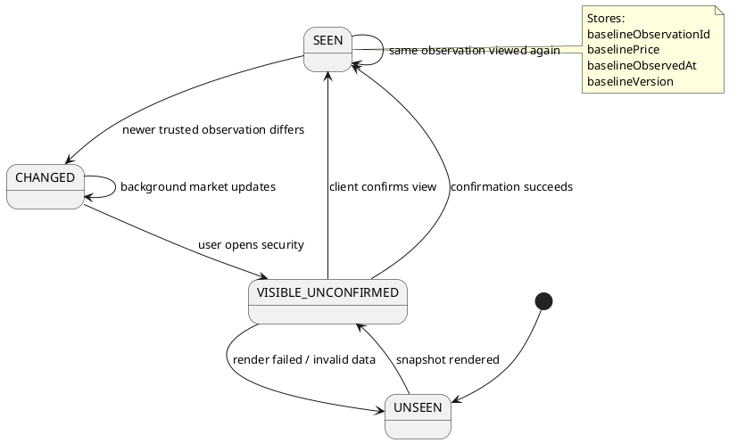

### Important interpretation

A background refresh should not transition:

``` text
CHANGED → SEEN
```

Only a valid user-view event should do that.

---

# 11. Sequence Diagram — Conflicting Market Data

This is a resilience scenario worth demonstrating during Q&A.

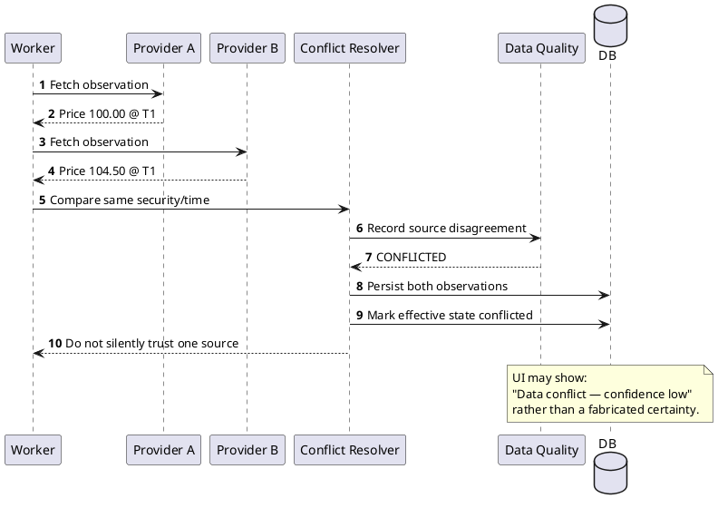

---

# 12. Sequence Diagram — Late-Arriving Observation

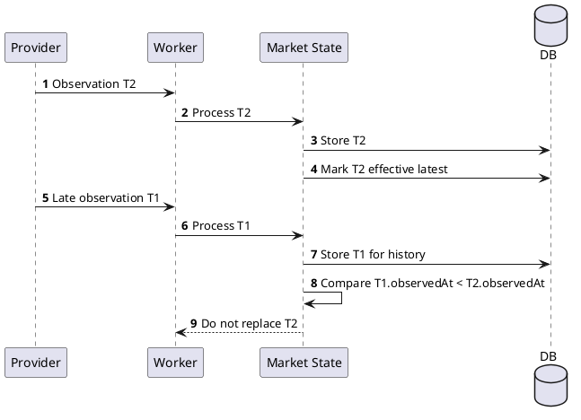

The important invariant is:

``` text
effectiveLatest = max(valid observations by observedAt)
```

not:

``` text
effectiveLatest = last packet received
```

---

# 13. Sequence Diagram — Corporate Action

This flow protects against false "huge movement" alerts.

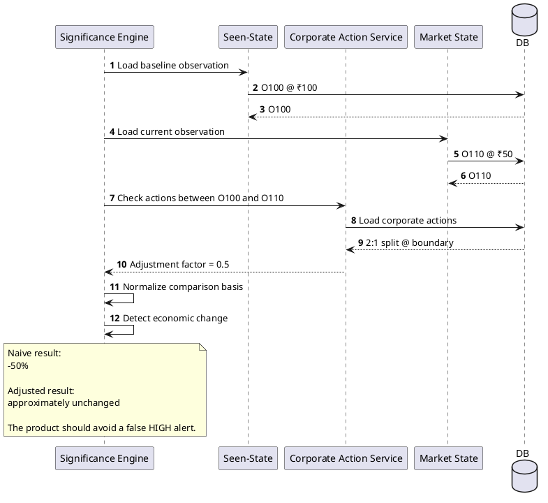

---

# 14. Deployment Diagram

The challenge does not need a large distributed deployment.

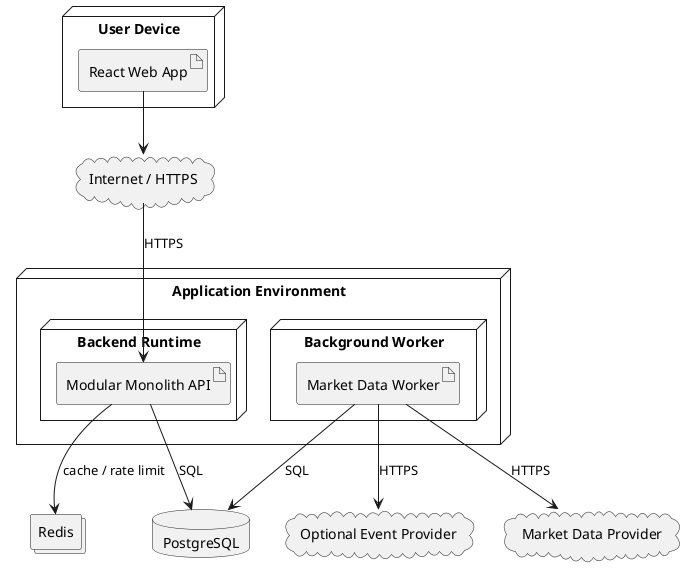

## 14.1 Deployment rationale

The architecture deliberately avoids:

``` text
Kubernetes
Kafka
multiple microservices
distributed event buses
```

for the initial build.

The product's engineering depth comes from:

``` text
correct state
+
correct market data handling
+
deterministic significance
+
resilience
+
traceability
```

rather than infrastructure complexity.

---

# 15. Data Flow Diagram

Although not strictly required as a UML diagram, this view is useful for
implementation alignment.

```text
                  EXTERNAL WORLD
                        │
                        ▼
               ┌────────────────┐
               │ Provider Adapter│
               └───────┬────────┘
                       │ raw
                       ▼
               ┌────────────────┐
               │   Validation   │
               └───────┬────────┘
                       │
                       ▼
               ┌────────────────┐
               │  Normalization │
               └───────┬────────┘
                       │
                       ▼
               ┌────────────────┐
               │  Data Quality  │
               └───────┬────────┘
                       │
                       ▼
               ┌────────────────┐
               │ Trusted Market │
               │     State      │
               └───────┬────────┘
                       │
          ┌────────────┼────────────┐
          ▼            ▼            ▼
      Benchmark      Sector     Historical
       Context       Context     Context
          │            │            │
          └────────────┼────────────┘
                       ▼
               ┌────────────────┐
               │ Change Signals │
               └───────┬────────┘
                       ▼
               ┌────────────────┐
               │ Significance    │
               └───────┬────────┘
                       │
               ┌───────┴────────┐
               ▼                ▼
          Attention         Confidence
               │                │
               └───────┬────────┘
                       ▼
               ┌────────────────┐
               │    Evidence    │
               └───────┬────────┘
                       ▼
               ┌────────────────┐
               │  Explanation   │
               └───────┬────────┘
                       ▼
                 USER SNAPSHOT
                       ▲
                       │
               ┌───────┴────────┐
               │  User Baseline │
               │   / SeenState  │
               └────────────────┘
```

---

# 16. API Interaction View

## Read path

```text
GET /watchlists/{id}/snapshot
        │
        ├── authorization
        ├── watchlist membership
        ├── snapshot version
        ├── trusted market state
        ├── user SeenState
        ├── ChangeAssessment
        ├── confidence
        ├── evidence
        └── ranking
                │
                ▼
        coherent JSON response
```

## Seen path

```text
POST /watchlists/{id}/items/{securityId}/seen
        │
        ├── authenticate
        ├── validate membership
        ├── validate observation
        ├── compare baseline version
        ├── reject stale transition
        └── atomic update
```

---

# 17. UML-to-Implementation Mapping

| UML element | Implementation module |
|---|---|
| User | `user` |
| Watchlist | `watchlist` |
| WatchlistItem | `watchlist` |
| Security | `security` / reference data |
| MarketObservation | `market-data` |
| MarketSnapshot | `market-state` |
| BenchmarkObservation | `market-context` |
| SectorObservation | `market-context` |
| SeenState | `seen-state` |
| Signal | `signal-engine` |
| ChangeAssessment | `significance-engine` |
| Evidence | `significance-engine` |
| DataQuality | `data-quality` |
| CorporateAction | `corporate-action` |
| ExplanationFact | `explanation` |

Recommended backend structure:

```text
src/
├── modules/
│   ├── auth/
│   ├── users/
│   ├── watchlists/
│   ├── securities/
│   ├── market-data/
│   ├── market-state/
│   ├── market-context/
│   ├── seen-state/
│   ├── signal-engine/
│   ├── significance-engine/
│   ├── confidence-engine/
│   ├── data-quality/
│   ├── corporate-action/
│   ├── explanation/
│   └── ranking/
│
├── workers/
│   ├── market-ingestion.worker.ts
│   └── event-ingestion.worker.ts
│
├── infrastructure/
│   ├── postgres/
│   ├── redis/
│   └── providers/
│
└── shared/
    ├── errors/
    ├── types/
    └── utils/
```

---

# 18. Critical Invariants

These invariants should become automated tests.

## INV-001 — Baseline monotonicity

```text
new baseline observedAt >= existing baseline observedAt
```

## INV-002 — Effective observation ordering

```text
latest effective observation =
max(valid observations by observedAt)
```

## INV-003 — No false confidence

```text
conflicted/stale/invalid evidence
    → cannot produce HIGH confidence
```

## INV-004 — Explanation provenance

```text
Every explanation fact
    → references a validated signal/evidence source.
```

## INV-005 — No unsupported context

```text
Missing sector/benchmark/history
    → NOT_AVAILABLE
not
    → fabricated zero / penalty.
```

## INV-006 — Corporate-action safety

```text
Price comparison crossing an adjustment boundary
    → adjusted comparison or downgraded confidence.
```

## INV-007 — User-state semantics

```text
Background refresh
    ≠
User saw the security.
```

## INV-008 — Snapshot coherence

```text
A watchlist response should not silently combine
incompatible market-state versions.
```

---

# 19. Top-20 Demo Scenarios Mapped to UML

| Demo scenario | Diagram to explain |
|---|---|
| User returns after several hours | User Snapshot Sequence |
| One stock moves much more than market | Activity + Context |
| Market-wide crash | Market Context + Significance |
| Volume spike | Activity |
| User opens on two devices | Seen-State Sequence |
| Older packet arrives late | Late Observation Sequence |
| Provider data conflicts | Conflict Sequence |
| Stock split occurs | Corporate Action Sequence |
| Market data is delayed | Ingestion + Confidence |
| Why is this marked HIGH? | Domain Class + Evidence |
| Why should I trust this alert? | Confidence + Provenance |
| Scale to many users | Component + Precomputation |

---

# 20. Recommended Diagram Presentation Order

For the final project documentation or presentation, use this order:

### 1. Component Diagram

Start with the architecture.

### 2. User Snapshot Sequence

Show the core product flow.

### 3. Domain Class Diagram

Show the state and entities that make the flow possible.

### 4. Significance Activity Diagram

Show the intelligence behind the product.

### 5. Seen-State Sequence

Show the unique "since your last check" architecture.

### 6. Resilience Sequences

Use conflict, late data, and corporate action examples during Q&A.

### 7. Deployment Diagram

Finish with the deliberately simple infrastructure.

This ordering tells a much stronger story than presenting generic UML diagrams
one after another.

---

# 21. Architecture Traceability

```text
PRD
 │
 ├── "since last check"
 │       ↓
 │    SeenState
 │
 ├── meaningful change
 │       ↓
 │    Signal + Significance
 │
 ├── market context
 │       ↓
 │    Benchmark/Sector Context
 │
 ├── reliability
 │       ↓
 │    DataQuality + Confidence
 │
 └── explanation
         ↓
      Evidence + ExplanationFact

SRS
 │
 ├── FR Watchlist
 │       ↓
 │    Watchlist Module
 │
 ├── FR Market Data
 │       ↓
 │    Market Worker + Market State
 │
 ├── FR Change Detection
 │       ↓
 │    Signal Engine
 │
 ├── FR Significance
 │       ↓
 │    Significance Engine
 │
 ├── FR Last Seen
 │       ↓
 │    Seen-State Module
 │
 └── NFR Reliability
         ↓
      Quality + Ordering + Concurrency
```

---

# 22. Final UML Design Decision

The UML model intentionally emphasizes the areas that make the project
different from a generic watchlist:

```text
                USER
                 │
                 ▼
          ┌─────────────┐
          │  SeenState  │
          └──────┬──────┘
                 │ baseline
                 ▼
       ┌────────────────────┐
       │ Current Market     │
       │ Observation        │
       └─────────┬──────────┘
                 │
        ┌────────┴────────┐
        ▼                 ▼
   Market Context    Historical Context
        │                 │
        └────────┬────────┘
                 ▼
          ┌─────────────┐
          │   Signals   │
          └──────┬──────┘
                 ▼
       ┌──────────────────┐
       │  Significance    │
       └────────┬─────────┘
                │
          ┌─────┴─────┐
          ▼           ▼
      Attention    Confidence
          │           │
          └─────┬─────┘
                ▼
          ┌───────────┐
          │ Evidence  │
          └─────┬─────┘
                ▼
         Explanation
                │
                ▼
              USER
```

The implementation should preserve this conceptual model even if individual
classes, endpoints, or framework details change.

The goal is not to have the most UML diagrams. The goal is for every diagram
to reinforce a real architectural decision. Focused class, sequence,
component, activity, and deployment views are generally more useful than
over-modeling the system. citeturn0search0turn0search4
